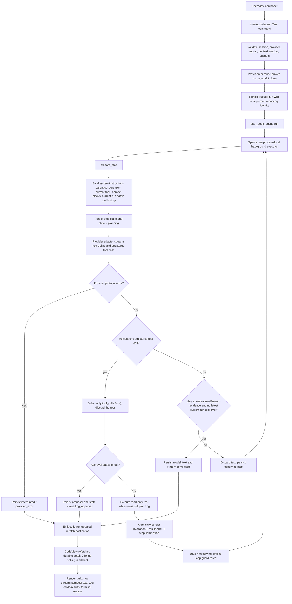
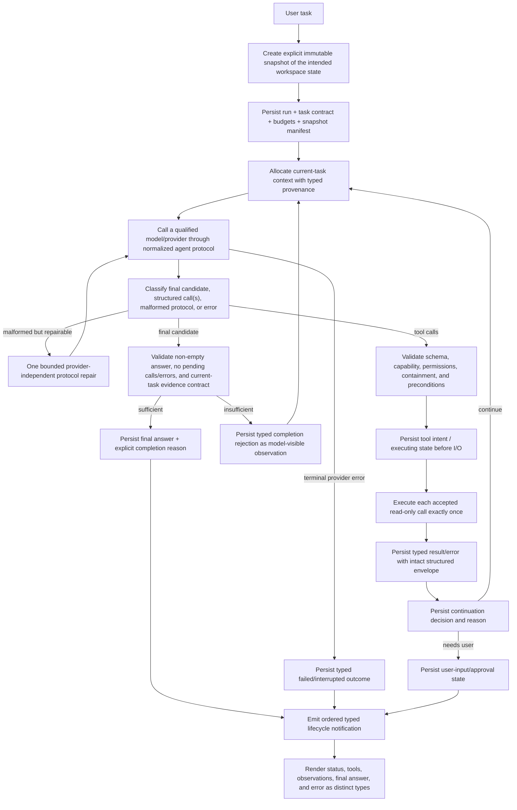

# Ark Code Agentic Flow Audit and Remediation Plan

**Status:** Audit complete; remediation proposed; no production behavior changed  
**Evidence date:** 2026-08-18  
**Audit target:** Current `E:\dev\Ark` working tree, native Tauri desktop flow, and the DevTrail project at `E:\dev\DevTrail`  
**Primary test provider:** Ollama at `127.0.0.1:11434`  
**Models exercised:** `qwen2.5:7b` and `llama3.2:latest`

> This document is an implementation plan, not an implementation. It deliberately does not patch Ark Code. “Completed” below means Ark's persisted lifecycle state; it does not imply that an answer was correct, complete, or readable.

## A. Executive Summary

Ark Code is currently **not reliable enough to serve as a repository coding agent**. Simple retrieval can work, but multi-file investigation, recovery from bad tool choices, completion, and answer quality are not dependable. Several runs persisted as `completed` without having inspected the implementation needed to answer the task. Other runs exhausted all steps, repeated invalid calls, or displayed a model-generated imitation of Ark's internal tool protocol as normal assistant text.

The architecture is not fundamentally a one-shot Ark Chat path. The current production code does contain a genuine background loop:

1. construct a model turn;
2. call a provider;
3. execute one selected tool;
4. persist its observation;
5. return to the model while the state is `observing`;
6. stop at a terminal or approval state.

That is an important positive finding: a complete rewrite is not justified. The runtime has useful foundations—durable runs, bounded tools, repository containment, native causal tool/result replay, cancellation, budgets, and strict schemas. Its current correctness contract is nevertheless too weak. The principal confirmed causes are:

1. **Ark is often inspecting the wrong repository content.** Ark's managed session repository is cloned from committed `HEAD` and intentionally excludes the user's modified and untracked working tree. DevTrail has 20 files in `HEAD` but 177 visible files in the current working tree; most of the actual application, including routes, authentication, Prisma data, actions, components, and tests, is untracked. All audited Ark sessions therefore saw the old starter scaffold, not the application the user meant by “DevTrail.”
2. **Completion evidence is scoped to the whole parent-run ancestry, not the current task.** Any successful `read_file` or `search` in an ancestor can authorize a later child run to complete without inspecting content for its new task. This allowed an unrelated one-turn answer to be accepted as final.
3. **Completion means little more than “no structured tool call was returned.”** Once the coarse evidence flag is true, Ark accepts any tool-free provider response, including empty or protocol-like text. It does not require a non-empty final answer, current-task evidence, resolved citations, or an explicit defensible completion reason.
4. **Provider capability metadata is treated as proof of agent capability.** Both local models advertise native tool support. Qwen completed a narrow control correctly; llama failed the identical prompt through schema-invalid calls. On another run llama emitted a long fictional tool transcript in plain text. Native mode has no centralized malformed-protocol repair path for that case.
5. **Tool orchestration loses valid model intent.** If a provider returns multiple tool calls in one response, Ark deliberately executes only `tool_calls.first()` and silently discards the rest. Existing tests encode this behavior.
6. **Tool results can be damaged before the model sees them.** Tools return structured, bounded JSON, but the agent then cuts every model text and observation at 8,000 characters by raw character count. This can split JSON, erase pagination metadata, and make a tool's own `truncated` field inaccurate from the model's point of view.
7. **Read-only tasks receive every Ark Code tool.** All eleven schemas—including edits, checkpoints, rollback, and command execution proposals—are exposed even when the task explicitly says not to modify or run anything. This increases selection load and failure probability, especially for small models.
8. **Conversation continuation contaminates new tasks.** The UI automatically makes every new request a child of the latest terminal run. Parent final text and tool observations are carried forward, including malformed or unrelated output, while the completion gate also trusts ancestral evidence.
9. **Durable lifecycle and observability are incomplete at the most useful boundaries.** A read tool is executed before its invocation is durably recorded; the database later commits the call and result together. Events record generic `step_completed` summaries, not tool request, execution duration, continuation decision, or completion reason. The normal log contains no usable per-run trace.
10. **The frontend cannot distinguish intermediate model narration from a final answer.** Streaming and persisted `model_text` are rendered as raw, pre-wrapped assistant bubbles. Correctly structured tool data gets separate cards, but textual protocol imitations and internal-looking JSON are displayed verbatim.

Model quality is therefore a confirmed contributor, but **“the model is weak” is not the root-cause conclusion**. In the same current build, qwen succeeded and llama failed an identical one-file prompt. Ark must qualify model/provider pairs and degrade safely, but it must also repair its repository snapshot, evidence scope, completion contract, provider protocol, context isolation, tool result format, lifecycle, and rendering.

Security boundaries held during the reproduced read-only runs: tools stayed inside Ark's managed repository; invalid absolute or malformed arguments were rejected; no edit, command, or source working-tree mutation occurred. The remediation must preserve those properties.

## Audit Scope and Method

The audit used four evidence sources:

- native Ark desktop runs through the actual React → Tauri → Rust → Ollama → durable database → event/refetch → React path;
- persisted agent runs, steps, tool invocations, observations, events, prompt manifests, terminal reasons, and session repository metadata in Ark's SQLite workspace;
- the current implementation in `src/features/code/CodeView.tsx`, `src/lib/ArkClient.ts`, `src-tauri/src/commands/mod.rs`, `src-tauri/src/code_agent.rs`, `src-tauri/src/providers/mod.rs`, `src-tauri/src/code_tools.rs`, `src-tauri/src/code_git_tools.rs`, and `src-tauri/src/db/mod.rs`;
- focused automated tests for the agent and provider layers.

The standalone Vite page was not accepted as a reproduction path because it cannot invoke native Tauri commands. Native WebView inspection was used for the final controls. Ollama was the only configured provider with selectable models in the tested environment, so this audit compares two models through one provider but does not claim cross-provider real-model coverage.

No source or configuration file was changed during reproduction. Three clearly named Ark Code sessions—`agent audit control`, `agent audit positive control`, and `agent audit llama control`—were created as read-only test data.

## B. Reproduction Matrix

### Environment facts

| Item | Observed value | Consequence |
|---|---|---|
| DevTrail source `HEAD` | `2f49432`; 20 files | This is a default Next.js scaffold. |
| DevTrail source working tree | 177 visible files; many modified/untracked paths | This is the application the audit prompts intend to inspect. |
| Ark managed repositories | Private clone plus `ark/session/<session-id>` branch | Safe isolation, but clone/checkout includes committed `HEAD` only. |
| Qwen model | `qwen2.5:7b`, 32,768 reported context, native tools | Can complete a narrow read; weak on broad reasoning in observed run. |
| Llama model | `llama3.2:latest`, 131,072 reported context, native tools | Advertises tools but repeatedly produces invalid arguments or textual pseudo-protocol. |
| Default maximum steps | 12 | Several runs consumed the full budget without useful investigation. |
| Agent observation cap | 8,000 characters | Lower than the underlying read/search tool output bounds. |

### Prompt outcomes

| Class | Prompt/run | Model | Actual tool sequence | Persisted result | Audit result |
|---|---|---|---|---|---|
| Positive simple control | “Read `package.json` and report the frontend framework named in its dependencies. Cite only `package.json`.” | qwen | `read_file(package.json)` → final | `completed` | **Pass for the narrow task.** Correctly reported Next.js `16.2.6`; clean response; no leak. |
| A — simple retrieval | “Identify the frontend framework and show me the files that establish this.” | qwen | `repository_map` → `search` → `search` → final | `completed` | **Partial/fail.** Reported React from `src/app/layout.tsx`, omitted Next.js and the requested supporting files. |
| Same-prompt model control | Exact positive-control prompt above | llama | invalid `search(path="package.json")` → invalid `repository_map(path=<absolute>)` → invalid `repository_map(max_entries="100")` repeated | `failed`, `repeated_identical_tool_call` | **Fail.** Same provider, snapshot, tools, and task as qwen; model/tool-compatibility defect isolated. |
| A — domain retrieval | “Find where lessons and exercises are represented.” | llama | `repository_map` → final | `completed` | **Fail.** Read no implementation. Treated `AGENTS.md`, `CLAUDE.md`, package metadata, and scaffold paths as feature evidence and admitted more investigation was needed. |
| B — targeted investigation | Architecture prompt including authentication, routing, lessons, and exercises | llama | `repository_map` → final | `completed` | **Fail.** Correctly guessed Next.js from names, then invented a PNPM/Express backend and possible MongoDB/PostgreSQL/Redis and treated instruction files as authentication evidence. |
| C — multi-file execution trace | “Trace the DevTrail startup flow across the relevant files.” | llama | no structured tool invocation; one provider response | `completed` | **Critical fail.** The displayed answer was an approximately 8,000-character fictional transcript containing fake tool calls/results and nonexistent edits, then truncation. |
| C — user journey trace | “Trace the main user journey…” | llama | invalid `repository_map(max_entries="20")` → invalid map → invalid map → final | `completed` | **Fail.** Final text contained malformed serialization of an inherited repository-map payload rather than an implementation trace. |
| D — repository-wide reasoning | Read-only technical-debt review requesting ten evidenced findings | qwen | map → six literal comment-marker searches → `read_file(README.md)` → `read_file(tsconfig.json)` → final | `completed` | **Fail.** Produced ten generic “lack of comments/TODOs” findings, including SVG assets, without reading the application implementation. |
| Runaway search | “What does this webapp do?” | llama | three root listings → searches for literal fragments such as “what does this webapp do?” and “webapp” until step 12 | `failed`, `agent_step_budget_exhausted` | **Fail.** Loop existed but investigation strategy never progressed. |
| Test-infrastructure investigation | Locate frameworks, tests, coverage, and gaps | llama | map → six tool-free rejected turns → directory list → malformed search → search → `git_status` → `git_diff` | `failed`, `agent_step_budget_exhausted` | **Fail.** Did not answer and used irrelevant operations after errors. |
| Repeated-call guard | Broad repository exploration | llama | repeated root directory listings, including invalid limits | `failed`, `repeated_identical_tool_call` | **Guard pass / task fail.** Ark stopped the loop safely but did not help the model recover. |

### Successful versus failing control

The strongest comparison is the exact `package.json` prompt in two fresh sessions:

| Boundary | Qwen success | Llama failure | Conclusion |
|---|---|---|---|
| Repository snapshot | Same committed DevTrail scaffold | Same committed DevTrail scaffold | Snapshot does not explain this A/B difference. |
| Ark system prompt and tool schemas | Same current runtime | Same current runtime | Prompt/schema transport is functional but not sufficiently model-compatible. |
| Provider | Ollama native tool mode | Ollama native tool mode | Not a provider-selection difference. |
| First action | Valid `read_file({"path":"package.json"})` | `search` with a file used as a directory | Qwen selected the correct tool; llama did not understand path semantics. |
| Error recovery | Not needed | Absolute-path field on `repository_map`, then numeric strings | Typed errors reached the next turns, but llama did not correct them. |
| Completion | Non-empty, concise, evidence-based final | Loop guard after five failed calls; no final | Ark can execute the happy path, but model qualification and recovery are inadequate. |
| Rendering | Clean assistant answer and tool card | Structured tool-error cards and a terminal reason | The UI can render structured failures; malformed textual protocol remains a separate backend classification problem. |

The qwen technical-debt run provides a second useful control: it proves that the production loop can perform many sequential provider/tool turns. Its poor synthesis proves that **mechanical continuation is necessary but not sufficient**.

## C. Current Architecture

### Actual execution path



### Boundary-by-boundary trace

1. **Prompt submission.** `CodeView.startRun()` trims the task and creates a run. If the latest displayed run is terminal, its ID is always supplied as `parentRunId`; a normal new message is therefore a causal child, not an independent task.
2. **Tauri command boundary.** `create_code_run` validates IDs, task, enabled provider, selectable model, reported context window, budgets, and the managed repository. It creates/reuses a private repository under Ark's workspace.
3. **Session repository.** `provision_session_repository` performs a local, no-hardlink, no-checkout clone and then checks out `ark/session/<session-id>` from `HEAD`. This intentionally excludes source working-tree modifications and untracked files.
4. **Run persistence.** The queued run stores the exact task, parent run, provider/model, repository path and identity, budgets, counters, state, and events.
5. **Automatic loop.** `start_run` owns a process-local cancellation handle and repeatedly calls `run_step_with_cancellation` while the durable state is `queued` or `observing`.
6. **Preparation and context.** `prepare_step` checks identity and budgets, walks up to 64 parent runs, reconstructs user/assistant turns, current-run native tool exchanges, and parent tool observations as untrusted retrieval blocks.
7. **Instructions and tools.** The runtime constructs one system instruction string with repository/evidence guidance and exposes all model-facing Ark Code schemas.
8. **Provider dispatch.** A step is claimed and marked dispatched before network I/O. Ollama receives system/conversation messages, untrusted context, current-run assistant tool calls plus `role: tool` results, and JSON schemas.
9. **Streaming.** Text deltas are accumulated and checkpointed to the step. Structured calls are accumulated separately. Text that merely looks like a tool protocol remains text.
10. **Tool selection/execution.** Only the first structured call is considered. Strict decoding and repository containment occur in the dispatcher. Read-only execution occurs before the invocation/result is durably inserted; both are committed together at the end of the step.
11. **Continuation/completion.** Any call normally produces `observing` and another model turn. A tool-free response is rejected until the ancestry contains one successful `read_file` or `search`, or while the latest current-run invocation failed. Otherwise it completes.
12. **Persistence/events.** The database transaction stores optional `model_text`, optional invocation/result, counters, state, terminal reason, and a generic `step_completed` event.
13. **Frontend propagation.** The backend emits a refetch-only `code:run-updated` event. The frontend also polls while nonterminal, then renders authoritative database rows.

### Current lifecycle model

The durable enum contains:

`queued`, `planning`, `awaiting_approval`, `executing_tool`, `observing`, `completed`, `failed`, `cancelled`, and `interrupted`.

The states are directionally appropriate, but current read-only execution does not fully honor the intended `planning → executing_tool → observing` boundary documented in ADR 0003. Read invocation intent is not committed before filesystem work, and generic step events do not expose the real decision points. `interrupted` is also terminal and requires a child retry.

### Current context on each iteration

**First iteration of an independent run** receives:

- Ark's system instructions with the managed repository path and the evidence rule;
- all Ark Code tool schemas;
- the current user task;
- optional selected parent-chain conversation and observations if a parent exists;
- workspace identity indirectly through the managed repository path;
- a prompt manifest containing counts and token estimates.

**Subsequent iterations** additionally receive exact current-run native tool call/result pairs in provider-causal format. Parent-run tool results are not replayed as native calls; they become untrusted retrieval context. The current task is still present on every turn.

The observed failures do **not** support “the original current task disappears” as the primary defect. Prompt manifests preserve it. The confirmed context defects are instead:

- stale repository contents;
- irrelevant and malformed parent content carried into new tasks;
- an ancestry-wide evidence flag authorizing unrelated completion;
- lossy observation truncation;
- insufficiently reproducible context manifests.

## D. Intended Architecture

Ark Code should retain its provider-independent, durable, repository-contained design but make the agent runtime—not the system prompt or UI—the authority for iteration and completion.



The authoritative loop contract should be:

- a provider turn can yield structured calls, a valid final candidate, a repairable malformed response, or a typed failure;
- every accepted tool call has a durable identity and outcome;
- every observation produces an explicit continuation decision;
- no stream end or individual tool completion implies run completion;
- final completion is non-empty, explicit, current-task scoped, and persisted with a reason;
- protocol classification occurs in the backend/provider layer, never through UI string heuristics;
- model capability determines eligibility or fallback protocol, but never changes core runtime semantics;
- repository files and tool output remain untrusted data;
- source workspace and managed execution workspace remain safely separated.

## E. Gap Analysis

| Area | Current behavior | Required behavior | Gap severity |
|---|---|---|---|
| Repository identity | Managed clone reflects committed `HEAD`; UI labels it as the project repository without a prominent content-basis warning. | Immutable snapshot must reflect the workspace state the user asked about, with an explicit manifest and visible basis. | Critical |
| Iteration | Production loop repeats `run_step` on `observing`. | Keep, but persist and test the complete production loop as one contract. | High test gap |
| Tool result continuation | Successful/error result generally causes another provider turn. | Every observation must have a persisted continuation decision and causal replay. | Medium |
| Multiple calls | First call executes; extras are silently lost. | Execute all accepted read-only calls in defined order/parallel policy, or return a typed rejection; never lose them. | High |
| Completion evidence | Any ancestral successful read/search sets one boolean. | Evidence must be task/run scoped, typed by provenance and purpose, with explicit follow-up reuse rules. | Critical |
| Final validation | Tool-free response + coarse evidence becomes completed; empty text is possible. | Require non-empty final candidate, no pending work, no unresolved errors, and current-task evidence acceptance. | Critical |
| Native protocol | Structured calls work; pseudo-protocol in text is ordinary text. | Detect malformed agent protocol centrally and repair or fail safely before completion. | Critical |
| Model readiness | Provider capability bit selects native/prompted/unsupported. | Qualify each model/version/provider pair with agent-loop conformance and expose its readiness. | High |
| Tool availability | All read/write/command tools exposed for all tasks. | Filter tools by task intent and granted capability; read-only task gets read-only tools. | High |
| Tool discoverability | Literal text search plus generic file map/list. | Clear file-finding vs content-search semantics and small-model-friendly schemas/examples. | Medium |
| Observation format | Structured result can be raw-cut at 8,000 characters. | Always valid, typed, paginated/truncated envelope with honest metadata. | High |
| Context history | Every new message becomes a child and inherits parent text/results. | Independent tasks and conversational follow-ups must be distinct; include only relevant, provenance-tagged history. | High |
| Lifecycle durability | Provider dispatch is durable; read intent/result are committed after execution. | Persist invocation/executing boundary before I/O and outcome afterward, consistent with ADR 0003. | High |
| Events | Generic queue/reserve/dispatch/step-complete events. | Typed request/execution/observation/decision/completion/error events with durations and reasons. | High |
| Streaming | Intermediate text and final text share the same content type. | Typed status/reasoning/final channels; only final is an assistant answer. | High |
| Frontend | Raw text rendering; machine terminal reason; no safe Markdown final rendering. | Distinct lifecycle components, readable final Markdown, typed error presentation, no protocol leakage. | High |
| Error recovery | Tool execution errors can loop; unknown/protocol errors usually interrupt provider-level work. | Typed taxonomy with defined retryability and bounded model-visible recovery. | High |
| Observability | Database has partial manifests/events; normal log has no usable run trace. | Explain any stop from run ID without exposing repository/secrets. | High |
| Deterministic tests | Good step/provider unit tests; no full scripted production-loop sequence. | Fake-model end-to-end loop suite is a release gate. | Critical confidence gap |

## F. Root Causes

### RC-01 — Managed repository does not represent the user's current workspace

- **Classification:** `CONTEXT`, `TOOL-EXECUTION`, `PERSISTENCE`
- **Evidence:** DevTrail `HEAD` contains 20 files. The current working tree exposes 177 files and has modified/untracked authentication, Prisma, routes, actions, components, tests, and configuration. `provision_session_repository` clones local Git objects and checks out a session branch from `HEAD`. The test `managed_clone_excludes_dirty_user_work_and_uses_dedicated_branch` and the behavioral-parity document state that excluding the dirty tree is intentional.
- **Affected components:** `code_git_tools.rs`, `commands/mod.rs`, code-session repository metadata, support-pane repository view, and all repository tools.
- **Severity / reproducibility:** **Critical; deterministic** whenever relevant source changes are not committed before session provisioning.
- **Downstream consequences:** Correct tools return correct results for the wrong code. The model cannot find real authentication, routes, exercise flows, state, or tests. It then guesses from scaffold filenames and dependencies. Real-model evaluation is invalid until this is fixed or explicitly controlled.

This is not a containment bug. It is a mismatch between safe isolation and the user's semantic expectation. The fix must preserve isolation while snapshotting the intended working state.

### RC-02 — Repository evidence is inherited across unrelated tasks

- **Classification:** `CONTEXT`, `LIFECYCLE`
- **Evidence:** `prepare_step` ORs `has_repository_content_evidence` across every run in the parent chain. `CodeView.startRun()` assigns the latest terminal run as parent for every new message.
- **Affected components:** `CodeView.tsx`, `code_agent.rs`, prompt allocation, completion logic.
- **Severity / reproducibility:** **Critical; deterministic** after any ancestor successfully calls `read_file` or `search`.
- **Downstream consequences:** A child task can complete without gathering evidence for its own request. Malformed parent output and irrelevant repository observations influence later tasks and consume context.

### RC-03 — Completion is inferred from absence of a tool call

- **Classification:** `AGENT-ORCHESTRATION`, `LIFECYCLE`, `ERROR-HANDLING`
- **Evidence:** When there is no tool call, Ark completes if the ancestry evidence boolean is true and the latest current-run invocation did not fail. The branch does not require non-empty text. It does not record why the task is believed complete or validate current-task citations/evidence.
- **Affected components:** `run_step_with_cancellation`, durable terminal fields/events, frontend terminal rendering.
- **Severity / reproducibility:** **Critical; common** once the evidence gate has been opened.
- **Downstream consequences:** Protocol imitations, incomplete narratives, unsupported guesses, or an empty response can become authoritative terminal success. A provider stream ending is effectively conflated with agent completion.

### RC-04 — Native tool support is mistaken for reliable agent capability

- **Classification:** `PROVIDER-ADAPTER`, `MODEL-CAPABILITY`, `ERROR-HANDLING`
- **Evidence:** Model metadata maps a reported `tools` capability directly to native mode. Qwen succeeds on the narrow control; llama fails the identical control with invalid fields/types and previously emitted fictional tool calls in `message.content`. Native mode does not apply the prompted-mode repair protocol to textual pseudo-calls.
- **Affected components:** provider model discovery, `stream_tools_for_model`, native response classification, model picker.
- **Severity / reproducibility:** **High to critical; model-dependent and frequent for llama in this audit.**
- **Downstream consequences:** Models are offered as Ark Code-capable when they cannot reliably select, serialize, recover, continue, and finalize. The runtime may accept malformed text as a final answer.

The provider adapter itself is not generally broken: 63 focused provider tests pass, including native Ollama schema transport, causal history, fragmented OpenAI calls, malformed streams, timeouts, and prompted repair. The missing layer is agent-protocol conformance and runtime validation above transport correctness.

### RC-05 — Conversation ancestry is always-on and insufficiently selective

- **Classification:** `CONTEXT`, `PERSISTENCE`
- **Evidence:** Every ordinary new message becomes a child. Parent user tasks, final `model_text`, and tool observations are included until allocator pressure removes them. The current task remains present, but irrelevant history can dominate smaller models.
- **Affected components:** `CodeView.tsx`, run creation semantics, `prepare_step`, allocator and compaction.
- **Severity / reproducibility:** **High; deterministic over long sessions.**
- **Downstream consequences:** Stale assumptions, malformed parent output, and unrelated evidence are treated as causal conversation. Context size grows without a task-relevance boundary.

### RC-06 — Tool exposure and recovery are poorly matched to read-only small-model work

- **Classification:** `TOOL-DEFINITION`, `MODEL-CAPABILITY`, `ERROR-HANDLING`
- **Evidence:** `provider_tool_definitions()` always returns eleven tools, including edit/checkpoint/rollback/command proposals. Llama confused directory and file paths, supplied an absolute repository root to a no-path tool, and serialized integers as strings. Errors were accurate but did not produce recovery.
- **Affected components:** model-facing registry, task/capability policy, descriptions and schemas, dispatcher errors.
- **Severity / reproducibility:** **High for weaker local models.**
- **Downstream consequences:** Larger schema context, incorrect selection, irrelevant write intent, repeated schema failures, and exhausted runs. Strict validation protects security but, without a controlled repair path, provides poor agent reliability.

### RC-07 — Agent-level truncation corrupts structured observations

- **Classification:** `CONTEXT`, `TOOL-EXECUTION`, `PERSISTENCE`
- **Evidence:** Read can return up to 400 lines/128 KiB; search up to 500 matches; Git diff up to 512 KiB. `truncate_for_storage` cuts the serialized output at 8,000 characters and appends text. A subsequent replay parses JSON if possible and otherwise wraps the damaged value as a string.
- **Affected components:** `code_agent.rs`, observation storage, provider tool-result construction, context replay.
- **Severity / reproducibility:** **High; deterministic for larger results.**
- **Downstream consequences:** Invalid JSON, missing `next_start_line`, misleading `truncated` state, unusable paths/lines, and failed multi-file reasoning.

### RC-08 — Additional tool calls in one model response are silently discarded

- **Classification:** `AGENT-ORCHESTRATION`, `PROVIDER-ADAPTER`
- **Evidence:** The runtime explicitly uses `tool_calls.first()`. The test `run_step_executes_only_the_first_of_multiple_tool_calls_in_one_response` treats this as expected.
- **Affected components:** agent response normalization, step model, provider call IDs/history, tests.
- **Severity / reproducibility:** **High whenever a provider emits multiple calls.**
- **Downstream consequences:** Missing observations, dangling model intent, causal mismatch on the next turn, and premature or confused synthesis.

### RC-09 — Read-only lifecycle transitions are not durable at the execution boundary

- **Classification:** `LIFECYCLE`, `PERSISTENCE`, `OBSERVABILITY`
- **Evidence:** The run remains `planning` while a read-only tool executes. Invocation and result are inserted together afterward. ADR 0003 specifies persisting invocation intent and entering `executing_tool` before external I/O. Events omit request/start/result boundaries.
- **Affected components:** `code_agent.rs`, `db/mod.rs`, run events, recovery.
- **Severity / reproducibility:** **High for diagnosis and crash correctness; lower immediate side-effect risk for reads.**
- **Downstream consequences:** A crash cannot show which read was requested or in flight; timing and continuation cannot be reconstructed; UI state may say “preparing” while a tool is executing.

### RC-10 — Structured agent output and user-visible text are not separated end to end

- **Classification:** `STREAMING`, `FRONTEND-RENDERING`, `PROVIDER-ADAPTER`
- **Evidence:** All provider text deltas are checkpointed as `streaming_text`, and accepted `model_text` is rendered as raw pre-wrapped assistant content. The startup trace displayed fictional calls/results/edits as an answer. There are no CodeView component tests covering protocol leakage or event ordering.
- **Affected components:** provider event model, step/observation types, `CodeView.tsx`, Markdown renderer.
- **Severity / reproducibility:** **High; observed.**
- **Downstream consequences:** Unreadable answers, leaked internal-looking serialization, intermediate status presented as final claims, and poor error comprehension.

The frontend is not solely at fault: it rendered the backend's `model_text` classification faithfully. The owning fix starts in provider/runtime classification and ends in typed rendering.

### RC-11 — Error taxonomy and recovery policy are incomplete

- **Classification:** `ERROR-HANDLING`, `LIFECYCLE`, `PROVIDER-ADAPTER`
- **Evidence:** Strict tool argument/execution errors become durable `tool_error` observations and can continue. Unknown tool/malformed native protocol generally surfaces as a provider error and terminal `interrupted`. Terminal UI exposes machine-style reasons. Generic step events can say “final response” even for a rejected tool-free turn that returns to `observing`.
- **Affected components:** provider validation, agent error mapping, database events, UI.
- **Severity / reproducibility:** **High.**
- **Downstream consequences:** Recoverable and terminal errors are mixed; users cannot tell whether to retry, fix configuration, change model, or change task; diagnostics do not state why continuation stopped.

### RC-12 — Observability cannot answer “why did this run stop?”

- **Classification:** `OBSERVABILITY`, `PERSISTENCE`
- **Evidence:** Prompt manifests record aggregate counts and tool names, and database events record queue/reserve/dispatch/complete. The normal application log contained no run ID, iteration, tool, duration, continuation, or completion trace for the audited runs.
- **Affected components:** diagnostics/logging, prompt manifest, provider timing, tool dispatcher, lifecycle events, run support pane.
- **Severity / reproducibility:** **High; universal.**
- **Downstream consequences:** Failures require manual correlation across tables and UI. Raw provider-versus-runtime-versus-rendering boundaries cannot be proven quickly.

### RC-13 — Tests prove components, not the production agent contract

- **Classification:** `AGENT-ORCHESTRATION`, `LIFECYCLE`, `OBSERVABILITY`
- **Evidence:** All 20 focused `code_agent` tests and all 63 provider tests passed. They cover useful step-level behaviors, but no test scripts the production `start_run` loop through search → read → search → read → final and asserts the complete event/context/state sequence. The only multiple-call test asserts that extra calls are dropped.
- **Affected components:** test harness, fake provider/model, Tauri integration, frontend component suite, CI.
- **Severity / reproducibility:** **Critical confidence gap.**
- **Downstream consequences:** A green test suite can coexist with an unusable agent. Regressions in continuation, completion, context scope, event order, and rendering have no release gate.

### RC-14 — Repository search primitives are safe but too limited for robust investigation

- **Classification:** `TOOL-DEFINITION`, `TOOL-EXECUTION`, `MODEL-CAPABILITY`
- **Evidence:** `search` is bounded and ignore-aware but literal-content-only. Filename discovery depends on a large repository map or directory navigation. Observed models searched natural-language prompt fragments instead of symbols and confused files with search directories.
- **Affected components:** repository tool registry, descriptions, result format, evaluator prompts.
- **Severity / reproducibility:** **Medium; amplifies weaker models.**
- **Downstream consequences:** Noisy maps, excessive turns, missed symbols/files, and step exhaustion.

## G. Production-Grade Fixes

### G1. Define and implement an explicit repository snapshot contract

**Addresses:** RC-01, RC-09, RC-12.

Create a first-class `RepositorySnapshot` rather than treating a Git clone path as sufficient identity. For the normal “inspect my current repository” mode, materialize a safe, immutable copy of the user's current visible working state into Ark-managed storage:

- include committed files with current modifications and visible untracked files;
- honor Ark's containment and ignore policy and never copy `.git` internals, external symlink targets, secrets selected for exclusion, submodule worktrees, or arbitrary device/special files;
- copy bytes without executing Git filters, hooks, shells, or repository programs;
- apply file-count, individual-size, total-size, path-length, and traversal limits with explicit failures or exclusions;
- record a manifest containing snapshot ID, canonical source root hash, source `HEAD`, branch, dirty/untracked counts, included/excluded counts and reasons, per-file or Merkle hashes, creation time, policy version, and whether the snapshot is `working_state` or `committed_head`;
- hash and bind the run to the immutable manifest, not only a directory identity;
- detect source changes after snapshot creation and show “snapshot is stale”; never silently retarget an existing run.

Keep Ark's isolated write model. A write-capable session should operate only inside the materialized managed repository/dedicated Ark branch and should not mutate the user's active checkout. Product may retain an explicit “committed HEAD only” mode, but it must be visibly selected and cannot masquerade as the current workspace.

**Migration:** Existing session repositories remain immutable and are marked `legacy_committed_head`; they are not silently refreshed. Starting a new session creates the new manifest. Any attempt to continue a legacy session shows its snapshot basis.

**Security:** The snapshot builder requires threat-model tests for symlinks/junctions, hardlinks, reparse points, ignored secret paths, races, case folding, reserved names, large files, and repository changes during copy. Isolation must remain at least as strong as today.

### G2. Make continuation and completion explicit runtime decisions

**Addresses:** RC-02, RC-03, RC-08, RC-09, RC-11.

Introduce a provider-independent `AgentTurnOutcome` and `ContinuationDecision` owned by the agent runtime. A turn may produce:

- one or more validated tool requests;
- a non-empty final candidate;
- a repairable malformed protocol response;
- a request for user input/approval;
- a typed terminal provider/runtime error.

After every observation, persist one decision: `continue_for_tool_result`, `continue_after_recoverable_error`, `await_user`, `complete`, `fail`, `cancel`, or `interrupt`, plus a stable reason code. Exact names may follow the existing conventions, but the semantic distinctions are required.

A final candidate is accepted only when all deterministic conditions hold:

1. provider output contains non-empty final text;
2. there are no pending or discarded tool calls;
3. the current run has no unresolved recoverable error;
4. the current task's evidence contract is satisfied;
5. every repository path cited as inspected exists in the snapshot and is present in recorded evidence;
6. no protocol envelope or tool-call serialization was misclassified as final text.

Evidence contracts must be current-task scoped. A new independent repository question requires current-run inspection. A genuine conversational follow-up may reuse explicitly selected parent evidence by provenance (for example, “summarize the files you just read”), but parent evidence must never activate a global boolean. An empty search is a successful observation but supports only a scoped absence claim; it is not blanket content evidence.

If a tool-free response is rejected, persist a typed, model-visible `completion_rejected` observation explaining the missing condition. Do not silently discard the text and consume another turn without feedback.

For multiple calls, choose and document one policy:

- execute all independently validated read-only calls, preserving provider call IDs and deterministic result order; or
- explicitly reject unsupported additional calls as a typed observation and ask the model to serialize them.

Silently discarding calls is forbidden. Mutating/proposal calls remain sequential and approval-bound.

### G3. Normalize provider agent responses and qualify models

**Addresses:** RC-04, RC-06, RC-08, RC-11.

All providers should map wire output to one normalized structure containing text channel/type, structured calls, call IDs, finish reason, usage, protocol mode, parse diagnostics, and raw-response hash. Core orchestration must not depend on provider-specific JSON beyond this boundary.

For both native and prompted modes:

- validate call name and full schema before presenting a turn outcome;
- recognize unambiguous tool-protocol-shaped text as malformed protocol, not final prose;
- allow at most one bounded, provider-independent repair turn with the invalid payload and exact schema error supplied as untrusted data;
- after repair failure, persist a typed `model_protocol_error`; never render the raw payload as the final answer;
- preserve fragmented streamed arguments and multiple call IDs;
- record finish reason and whether the provider ended with text, calls, or neither.

Do not scatter special cases for Ollama models. Add a versioned **Ark Code agent readiness probe** for each provider/model digest. It should deterministically test:

1. correct native or prompted call selection;
2. schema-valid arguments, including integer/boolean types;
3. receipt and use of a tool result;
4. a second different tool call;
5. recovery after a typed tool error;
6. a clean final answer with no pseudo-protocol.

Persist results as `agent_ready`, `limited`, `chat_only`, or `unknown` with probe version, model digest, provider version, and timestamp. Ark Code should default to qualified pairs. An unqualified model may be offered only with an explicit limitation and a controlled prompted fallback if it passes that protocol; a provider “tools” capability bit alone is insufficient.

Safe, non-lossy schema normalization (for example, converting an integer-shaped JSON string to an integer) may be considered in the centralized protocol layer only if specified, tested, logged, and impossible to broaden paths or permissions. The primary recovery mechanism should remain a typed correction turn, not permissive coercion.

### G4. Separate task conversation, evidence, and repository data in context

**Addresses:** RC-02, RC-05, RC-07, RC-12.

Replace the current ancestry-wide assembly with typed context items:

- current task and task/run ID;
- snapshot manifest summary;
- selected conversational turns;
- current-run native tool exchanges;
- explicitly reused parent evidence with source run/tool/path/line/hash;
- compaction summary that cites the item IDs it replaces.

Independent task versus follow-up must be an explicit run-creation choice, not inferred solely from “there is a previous run.” The UI can default conversational wording to a follow-up only when the user is clearly continuing, but it must offer “new task in this session” and avoid parent evidence for that mode.

Every iteration must include the original current task verbatim or by immutable task reference and record its hash. Context allocation should operate on complete typed items; it must never cut through a JSON tool envelope. Newest causal tool exchanges and current-task instructions remain mandatory. Parent material is optional and relevance-selected.

Persist a redacted `ContextManifest` with item IDs/hashes, roles/types, token estimates, included/excluded reason, compaction version, tool-schema version, system-prompt version, and snapshot ID. Full private file contents need not be logged to reproduce the allocation decision.

Repository content and prior model text remain untrusted provider context and can never enter the system-instruction channel or alter permissions.

### G5. Make tools task-scoped, discoverable, and structurally bounded

**Addresses:** RC-06, RC-07, RC-14.

Build the provider tool set from the run's task capability policy:

- a read-only investigation exposes only repository map/list/find/read/search, safe Git inspection where relevant, and clarification;
- edit/checkpoint/rollback/command proposals appear only when the task and user-granted workflow permit them;
- unavailable tools are absent from both schemas and instructions.

Clarify tool boundaries with compact examples in schema descriptions:

- directory paths are relative directories;
- file reads take a relative file path;
- `repository_map` accepts only an optional integer limit;
- content search is not filename search.

Add a bounded `find_files` capability or a clearly separated filename mode rather than forcing filename discovery through a thousand-entry map. Keep text search literal by default for safety; optional glob/regex behavior must be separately bounded and explicit.

Every tool returns a stable envelope:

```text
status
data or typed error
request summary
limits applied
truncated
continuation cursor/range
duration
```

Truncation/pagination occurs before serialization and always produces valid JSON. Empty success is distinct from failure. Storage and model-context limits use the same envelope metadata. The runtime must not perform a second raw character cut.

### G6. Bring durable lifecycle, events, and errors into conformance

**Addresses:** RC-03, RC-09, RC-11, RC-12.

Preserve the existing top-level states where they fit, but make transitions authoritative:

1. persist validated invocation and transition/annotate `executing_tool` before read I/O;
2. execute once;
3. persist typed observation and `observing` afterward;
4. persist continuation decision before the next provider dispatch;
5. persist final answer and completion reason atomically.

Read-only in-flight work can be safely classified on restart, but it still must be visible. Mutating tools continue to follow ADR 0003's approval, precondition, intent, verification, and non-replay contract.

Define a typed error taxonomy with at least:

- provider unavailable/model unavailable/authentication;
- provider transport timeout/incomplete stream;
- provider protocol/malformed response;
- unknown tool/invalid arguments/unsupported capability;
- permission denied/approval rejected or expired;
- repository snapshot unavailable/stale/changed;
- tool execution failed/empty success/truncated result;
- context too large/compaction failure/token budget;
- step/time/cost/loop limit;
- persistence/lease/event propagation;
- user cancellation and recovery outcome.

Each error specifies owner layer, retryability, whether a model correction turn is allowed, durable terminal state, user message, diagnostic code, and redaction policy. A raw internal error must never be stored as normal assistant text.

Events should include `run_queued`, `turn_reserved`, `provider_started`, `provider_finished`, `tool_requested`, `tool_started`, `tool_finished`, `observation_committed`, `continuation_decided`, `completion_candidate_rejected`, and terminal completion/error/cancel events (names may follow project style). Sequence and durable rows remain authoritative; frontend events remain refetch notifications.

### G7. Render typed lifecycle content, not protocol-shaped strings

**Addresses:** RC-10, RC-11.

Extend the backend contract and frontend types so the UI separately renders:

- assistant status/progress;
- optional reasoning summary, if the provider/runtime supports an appropriate safe summary;
- tool request card;
- tool result/error card;
- approval or user-input request;
- final assistant answer;
- terminal runtime error.

Only a backend-accepted final candidate becomes the normal assistant answer. Intermediate text must be labeled and must not look terminal. Render final Markdown with the existing safe Markdown policy; keep tool/error JSON in bounded diagnostic components. Show a concise human explanation plus stable error code and a diagnostics disclosure. Event gaps and duplicate notifications must refetch without duplicating timeline items.

Do not add UI regexes that try to recognize arbitrary model JSON. Protocol classification belongs to G3/G2.

### G8. Add structured, privacy-preserving observability

**Addresses:** RC-09, RC-11, RC-12, RC-13.

For every run/turn, make the following queryable in the development diagnostics view and structured local logs:

| Field | Required detail |
|---|---|
| Run | run ID, parent/follow-up mode, session, task hash, snapshot ID, lifecycle state |
| Iteration | zero-based turn, step budget before/after, active duration |
| Model | provider ID/type, model name and digest, tool mode, readiness probe version/result |
| Context | system/tool schema versions, estimated/actual input tokens, item counts/hashes, compaction decision |
| Provider | request ID/hash, start/end/duration, finish reason, usage, retry/repair count, protocol classification |
| Tool | call ID, tool name, redacted/canonical argument hash, validation result, start/end/duration, result status/hash/size/truncation |
| Decision | continuation decision, evidence contract status, completion rejection or completion reason |
| Error | owner category, stable code, retryability, recovery outcome |
| Event delivery | durable sequence, notification/refetch sequence, detected gap/duplicate |

Default logs must not contain whole prompts, file contents, secrets, credentials, arbitrary command output, or raw provider bodies. Store hashes, sizes, stable IDs, bounded redacted summaries, and explicit opt-in local debug bundles. Tool arguments such as queries and paths need a documented privacy classification. All credential-bearing headers and secret fields are redacted before logging.

An opt-in sanitized replay bundle should contain versions, manifests, fake/scrubbed observations or hashes, event sequence, and provider classification sufficient to reproduce the lifecycle without exporting private repository contents.

### Compatibility and migration implications

| Concern | Required treatment |
|---|---|
| Existing sessions | Preserve records; label legacy committed-HEAD snapshots; require a new snapshot/session for current-workspace inspection. |
| Database | Versioned migrations for snapshot manifests, turn outcomes, continuation/completion reasons, typed errors, durations, and richer events; migrations must be backward-readable by the current diagnostics importer where required. |
| Provider APIs | Keep native Ollama and OpenAI-compatible transports; add normalization above them. Prompted fallback remains provider-independent. |
| Model selection | Existing selectable models are not automatically “agent-ready”; run/cached conformance may change their Ark Code eligibility without changing Ark Chat eligibility. |
| Tool contracts | Version schemas and result envelopes. Do not replay old invocation JSON against a new schema without recorded version/adapter. |
| Frontend | Add new typed timeline items while retaining rendering for legacy observations. Never reinterpret legacy raw text as trusted controls. |
| Security | No generic shell, source-checkout mutation, permission broadening, or provider-supplied repository root. All snapshot and tool paths remain Ark-derived and contained. |

## H. Dependency-Safe Implementation Order

The order below follows architectural dependencies rather than symptom severity.

### Phase 0 — Approve contracts and freeze reproducible fixtures

1. Approve a new ADR or amendment covering snapshot semantics, normalized agent turn outcomes, completion authority, multi-call policy, context/evidence scope, and typed events/errors.
2. Freeze a small Git fixture with committed, modified, untracked, ignored, symlink/junction, large, and binary files.
3. Freeze a scrubbed DevTrail evaluation revision and a human-reviewed ground-truth manifest of expected files/flows.
4. Record the current failing persisted runs as non-secret regression descriptions.

**Exit:** No implementation starts until the runtime and snapshot contracts are reviewable and security owners agree on boundaries.

### Phase 1 — Build the deterministic full-loop harness first

1. Add a fake provider/model that scripts normalized turn outcomes and captures every received context manifest.
2. Drive the real production loop entry point, durable database, tool dispatcher, and event publisher—not repeated direct calls to `run_step` only.
3. Add the mandatory sequence/recovery/completion tests in Section I and confirm that tests representing current defects fail for the intended reasons.

**Dependency:** Phase 0 contracts.  
**Exit:** CI can demonstrate the missing behavior before runtime edits begin.

### Phase 2 — Correct repository snapshot semantics

1. Implement the safe materialized snapshot and manifest.
2. Bind new runs/tools/context to snapshot ID and policy version.
3. Add staleness detection and visible snapshot basis.
4. Mark legacy sessions without retargeting them.

**Dependency:** Phase 0 snapshot contract and fixture.  
**Exit:** Fake and integration tests prove modified/untracked visible files are included and excluded paths remain inaccessible.

### Phase 3 — Normalize provider outcomes and qualify models

1. Add normalized agent response/finish classification across Ollama and OpenAI-compatible adapters.
2. Add bounded malformed-protocol repair for native and prompted modes.
3. Preserve all structured calls and finish reasons.
4. Implement versioned model readiness probes and picker status.

**Dependency:** Phase 1 fake protocol; independent of UI.  
**Exit:** Transport tests plus conformance fixtures distinguish agent-ready, limited, and malformed models without provider-specific runtime branches.

### Phase 4 — Establish durable turn/tool/decision events

1. Migrate persistence for snapshot, turn outcome, invocation-before-I/O, durations, typed error, continuation decision, and completion reason.
2. Make read-only tools follow the durable execution boundary.
3. Add restart/cancellation/event-gap tests.
4. Add privacy-preserving structured diagnostics early so remaining phases are observable.

**Dependency:** Phase 0 lifecycle contract; Phase 3 normalized fields.  
**Exit:** A fake-model run can be reconstructed from events and manifests, including why it continued or stopped.

### Phase 5 — Replace orchestration and completion semantics

1. Consume normalized outcomes; handle every structured call according to the approved multi-call policy.
2. Add explicit continuation decisions.
3. Make evidence current-task scoped and implement typed completion rejection.
4. Require a non-empty accepted final candidate and explicit completion reason.
5. Preserve budget, cancellation, approval, lease, and loop-guard safety.

**Dependency:** Phases 1, 3, and 4.  
**Exit:** The entire deterministic suite passes through the production loop.

### Phase 6 — Rebuild context and tool contracts

1. Separate independent task/follow-up semantics and typed context items.
2. Implement reproducible context manifests and item-safe compaction.
3. Version task-scoped tool sets and result envelopes.
4. Remove raw character truncation; add pagination and file finding.
5. Tune compact descriptions from deterministic/model eval evidence, not prompt growth.

**Dependency:** Phase 5 evidence and continuation model.  
**Exit:** Long multi-step tests preserve current task, causal call/result pairs, valid structured observations, and security channels.

### Phase 7 — Update frontend rendering and diagnostics

1. Render typed status, tool activity, final answer, and error separately.
2. Add safe final Markdown rendering and human-readable error actions.
3. Display snapshot basis/staleness, model readiness, continuation/completion reason, and run diagnostics.
4. Add component tests for ordering, streaming, gaps, cancellation, malformed protocol, and no-leak behavior.

**Dependency:** Stable Phase 4 event and Phase 5 outcome contracts.  
**Exit:** Backend state and frontend state agree at every lifecycle boundary; protocol data cannot appear as final prose.

### Phase 8 — Run real-model qualification and DevTrail regression

1. Run provider/model conformance.
2. Run the Section J evaluation on fresh working-state snapshots.
3. Tune only the owning layer exposed by evidence.
4. Publish qualified model/provider baselines and known limitations.

**Dependency:** Phases 2–7 and all deterministic tests green.  
**Exit:** Section K criteria pass. Only then resume autonomous write/edit/terminal expansion.

## I. Test Requirements

### Deterministic fake-model agent-loop suite

Every case must call the production loop entry point, persist to a real temporary database, execute real bounded fixture tools, and capture ordered provider requests/events. It must not rely on a real model.

| Test | Scripted model behavior | Required assertions |
|---|---|---|
| One tool then final | `read_file(a)` → final | Two provider turns; call/result paired; current task present twice; one final; completed reason recorded. |
| Canonical five-turn trace | `search(submitAnswer)` → `read_file(action)` → `search(updateProgress)` → `read_file(store)` → final | Exact order, five iterations, four invocations/results, no dropped task, final only after fourth observation. |
| Many sequential calls | 10 alternating search/read calls → final | No manual stepping; budgets/counters/events monotonic; context compaction preserves newest causal history. |
| Multiple calls in one response | two independent reads in one provider turn | Both execute once in defined policy and both results reach next turn, or the second is explicitly rejected; never silent loss. |
| Empty search recovery | search returns zero → alternate filename search/map → read → final | Empty success is distinguishable; run continues; absence is not treated as global evidence. |
| Tool failure recovery | missing file → corrected search/read → final | Typed error reaches model; no terminal state on recoverable error; completion blocked until recovery. |
| Invalid arguments | numeric string/unknown field/wrong path kind → corrected call | Exact schema error, one bounded correction path, permissions unchanged. |
| Unknown tool | model requests unknown name | Typed model protocol/tool error; bounded repair or clear terminal reason; no execution. |
| Textual pseudo-tool protocol | model emits tool JSON/transcript only as text | Not rendered/accepted as final; repair invoked once; typed failure after failed repair. |
| Provider failure before response | transport unavailable | Typed terminal owner/retryability; no phantom invocation; durable reason. |
| Incomplete streamed response | text/call fragments then close | No final; partial text labeled status/diagnostic; interrupted with provider protocol category. |
| Cancellation during provider | delayed provider; user cancels | Persist request, drop work, conservative terminal semantics, ordered events, no next turn. |
| Cancellation during read | delayed fake read after intent | Invocation visible before I/O; outcome/recovery follows approved lifecycle; no duplicate execution. |
| Step limit | model calls a different tool until limit | No provider dispatch beyond limit; `agent_step_budget_exhausted`; exact counter. |
| Token/context limit | required items exceed context | Typed pre-dispatch failure; no silent omission of task/tool schema. |
| Repeated call loop | same canonical call three times with no new state | Guard fires at specified point; typed reason; no fourth execution. |
| Premature final before evidence | immediate answer | Final candidate rejected and model receives reason; no displayed final. |
| Parent evidence isolation | parent reads auth; child asks state-management question then answers immediately | Child cannot complete from parent evidence unless explicitly declared follow-up reuse satisfies the contract. |
| Explicit follow-up reuse | child asks to summarize exact parent read | Selected parent evidence included by provenance; no unnecessary re-read required; no global evidence flag. |
| Empty final | provider ends with empty text and no call | Never `completed`; repair/retry or typed failure. |
| Context preservation | 20-turn run with compaction | Original task hash, snapshot ID, and latest causal exchanges present every time; manifest explains exclusions. |
| Observation truncation | read/search result exceeds budget | Valid JSON envelope, honest truncation, continuation cursor, no split data. |
| Crash/restart boundary | inject crash before and after invocation intent/result commits | Recovery never duplicates execution and exposes exact proven state. |
| Event delivery | duplicate, delayed, and skipped notifications | Durable sequence remains authoritative; frontend refetch produces one correctly ordered timeline. |

### Repository snapshot tests

- modified tracked file content is the content read by the agent;
- visible untracked files are included;
- deleted working-tree files are absent;
- ignored/excluded paths follow the approved policy and exclusion is reported without leaking names where sensitive;
- `.git`, hooks, filters, external symlinks/junctions, submodule escapes, hardlink surprises, and special files cannot enter or escape the snapshot;
- source mutation during snapshot causes retry/failure, never a mixed manifest;
- size/file/path limits are explicit;
- snapshot hashes change only when included content/policy changes;
- source working tree/index/branch is never mutated;
- legacy committed-HEAD sessions remain readable and visibly labeled.

### Provider and model-protocol tests

- Ollama and OpenAI-compatible native calls preserve all call IDs and strict arguments across streaming fragmentation;
- prompted fallback repairs exactly once and accounts for both attempts;
- native textual pseudo-calls use the same repair classification;
- call-looking prose that is genuinely quoted in an answer is not executed;
- finish reason, usage, partial content, multiple calls, malformed frames, redirects, authentication errors, timeouts, and cancellation remain typed;
- readiness probe results are invalidated when model digest, provider version, schema version, or probe version changes;
- an unqualified model cannot be silently presented as agent-ready.

### Context and security tests

- system instructions contain only Ark-owned policy and identity data;
- repository/tool/model text is always untrusted context;
- prompt injection in source cannot grant permissions, alter snapshot root, select commands, or mark completion;
- every cited inspected path in an accepted final corresponds to current-task evidence in the immutable snapshot;
- compaction is deterministic for the same typed items/budget;
- no logs/manifests contain secrets, credentials, whole private files, or raw provider bodies by default;
- write/command tools are absent from read-only provider requests;
- approval hashes, preconditions, command allowlists, and repository containment retain existing coverage.

### Frontend acceptance tests

- progress text, tool action, tool result, final answer, and error render as distinct components;
- a final answer appears once and only after backend completion;
- raw pseudo-tool JSON cannot be rendered as trusted controls or accepted final output;
- Markdown code/path references are readable and sanitized;
- lifecycle state, activity label, stop/cancel, approval, and terminal reason match durable backend state;
- notification duplicates/gaps and 750 ms fallback polling do not duplicate or reorder content;
- long tool output is bounded without corrupting the underlying structured result;
- model readiness and snapshot basis/staleness are visible before a run;
- legacy runs remain readable.

### Validation performed during this audit

- `cargo test code_agent --lib`: **20 passed**, 0 failed.
- `cargo test providers::tests --lib`: **63 passed**, 0 failed.
- Native read-only qwen/llama control runs completed as described in Section B.

These passing tests validate existing components; they are not evidence that the end-to-end agent contract is repaired.

## J. Real-Model DevTrail Read-Only Evaluation

Real-model evaluation begins only after every deterministic test above is green and the run uses a verified working-state snapshot.

### Controlled setup

- Pin a reviewed DevTrail revision/working-state fixture and snapshot manifest.
- Maintain a human-reviewed ground-truth file listing required facts, acceptable inferences, relevant paths, and prohibited/hallucinated paths for each prompt.
- Start every evaluation in a fresh independent session/run with no ancestral evidence.
- Use temperature zero where supported; otherwise record provider defaults.
- Record provider version, model name/digest, readiness result, schema/system/context versions, hardware, and snapshot ID.
- Repeat each prompt at least five times per provider/model pair; increase to ten for release candidates.
- Evaluate only pairs presented as `agent_ready`; retain limited-model results as diagnostic, not as product pass evidence.

### Prompt suite

**Easy**

1. “Read `package.json` and identify the frontend framework. Cite the dependency that proves it.”
2. “Find where application routes are defined and explain the important routes.”
3. “Find where lessons and exercises are represented. Cite the defining files.”
4. “Determine whether DevTrail has authentication. Identify login, logout, identity/session handling, and protected-route enforcement, or state clearly that a piece is absent.”

**Medium**

1. “Trace what happens when a learner submits an answer to a programming exercise, from the UI action through validation/evaluation to completion and any progress update.”
2. “Follow application startup from the framework entry points through the root layout, providers, middleware, and initial data loading.”
3. “Determine how learner progress is stored and restored after a refresh or restart.”
4. “Inspect the test infrastructure: frameworks, locations, covered areas, and major evidence-backed gaps. Do not run tests.”

**Hard**

1. “Analyse DevTrail's state-management architecture. Identify each major state domain, owner, update path, consumers, and whether it survives reload.”
2. “Trace the complete exercise lifecycle across routes/components, server actions or APIs, persistence, and the views that reflect completion. Distinguish confirmed behavior from inference.”
3. “Assess the authentication and authorization trust boundaries from browser to server to database, including route protection and role checks. Report only findings supported by inspected code.”

### Per-run record

Record:

- provider/model/digest/readiness result;
- success, partial, or failure plus failure owner;
- total iterations and provider repair turns;
- ordered tools and canonical argument validity;
- files inspected and relevant files missed;
- current-task evidence items and citations;
- hallucinated/nonexistent/uninspected paths;
- factual correctness, trace completeness, and fact/inference separation;
- premature completion or unnecessary continuation;
- protocol leakage/readability;
- typed errors and recovery;
- input/output tokens, model/tool/total duration;
- final/terminal reason and frontend/backend agreement.

### Scoring and proposed baseline

Use a 100-point rubric per run:

- 35 factual correctness against ground truth;
- 25 required layers/files/flow completeness;
- 15 evidence quality and valid path citations;
- 10 efficient, appropriate tool strategy and recovery;
- 10 readable synthesis with fact/inference separation;
- 5 lifecycle/protocol cleanliness.

Hard failures regardless of score:

- any invented file or claim presented as inspected fact;
- any leaked tool/protocol serialization in the final answer;
- any source workspace/security boundary violation;
- final completion with no qualifying current-task evidence;
- backend/frontend terminal-state disagreement.

Proposed release baseline for every provider/model pair labeled `agent_ready`:

- easy: at least 95% successful runs and mean score ≥ 90;
- medium: at least 85% successful runs and mean score ≥ 82;
- hard: at least 75% successful runs and mean score ≥ 75;
- 0 hallucinated paths, 0 protocol leaks, 0 security violations, and 0 backend/frontend state disagreements across the suite;
- 100% correct classification for provider/tool failures and iteration limits.

At least one supported local-model pair must meet the entire baseline before Ark Code is called repaired. Other models may remain visibly `limited`; their failures must not be hidden by lowering runtime correctness criteria.

## K. Exit Criteria

Ark Code's read-only agentic foundation is repaired only when all of the following are demonstrated in CI and the reviewed DevTrail suite:

1. **Repository correctness:** the run visibly uses an immutable snapshot of the intended current workspace, including permitted modified/untracked content, with no source mutation or boundary escape.
2. **Simple retrieval reliability:** qualified models pass the easy baseline with real file evidence.
3. **Multi-file investigation:** medium/hard tasks traverse every required layer often enough to meet the agreed baseline.
4. **Sequential tools:** deterministic tests prove arbitrary bounded search/read cycles and production-loop auto-continuation.
5. **Observation feedback:** every tool result/error is causally paired and present in the next relevant model turn.
6. **Task preservation:** current task hash/text, snapshot identity, and latest causal evidence survive all iterations and compaction.
7. **Alternative investigation:** empty search and missing file cases lead to a different evidence-seeking action rather than automatic termination.
8. **Error recovery:** recoverable tool/schema errors receive bounded typed correction; terminal provider/runtime errors are correctly classified.
9. **Completion authority:** one tool completion, stream end, some text, ancestral evidence, or an empty response can never independently complete a run.
10. **No protocol leakage:** final answers are readable and contain no internal tool-call/result serialization unless the user explicitly asked to see a diagnostic representation.
11. **Typed, understandable errors:** every catalogued failure has an owner, code, retryability, durable state, and useful user message.
12. **Frontend/backend agreement:** activity, approval, continuation, completion, cancellation, and failure match durable state under normal, duplicate, delayed, and gapped events.
13. **Deterministic gate:** every fake-model, snapshot, provider-protocol, context, lifecycle, security, and frontend acceptance test in Section I passes.
14. **Real-model gate:** every model/provider pair sold as agent-ready meets Section J; at least one local pair meets the full baseline.
15. **Diagnosability:** given a run ID, developers can determine snapshot, iteration, model, context allocation, requested tool, result, durations, continuation decision, completion reason, and error category without reverse-engineering UI text.
16. **Security preservation:** no fix weakens repository containment, untrusted-context separation, approvals, precondition binding, command allowlisting, secret redaction, or source-checkout isolation.
17. **Migration clarity:** legacy sessions are accurately labeled and no run is silently moved to a different repository snapshot or schema.
18. **Review approval:** architecture, security, product behavior, and evaluation baseline are explicitly reviewed before enabling more autonomous write/edit/terminal workflows.

Until these criteria are met, Ark Code should be described as experimental for repository investigation. Autonomous edits, command execution, feature implementation, refactoring, or recovery should not be treated as trustworthy simply because their safety approval layers exist.

## Appendix 1 — Current Repository Tool Audit

The underlying read-only tools are generally contained and bounded. Their principal defects for this task are the stale managed snapshot, discoverability, and agent-level representation—not unrestricted filesystem behavior.

| Tool | Request and actual execution | Native tool result before agent cap | Model-visible behavior and finding |
|---|---|---|---|
| `repository_map` | Optional integer `max_entries`; ignore-aware walk of context-eligible files; no contents; maximum 2,000 entries | JSON entries with relative path, kind, byte size/context eligibility, inspected/skipped counts, `truncated` | Useful navigation. Models incorrectly treated names as code evidence. Current prompt explicitly warns against this. Large JSON may be cut at 8,000 characters. |
| `list_directory` | Required relative directory; direct children; maximum 500 | JSON path, entries, `truncated` | File-versus-directory semantics are strict. Llama repeatedly listed root or used inappropriate paths. It cannot establish implementation behavior. |
| `read_file` | Required relative text-file path; optional 1-based start/max lines; maximum 400 lines, 128 KiB output, 1 MiB candidate file | JSON path, line range, total lines, content, SHA-256, `truncated`, `next_start_line` | Correct positive control. Agent's 8,000-character cut can split JSON and remove continuation metadata. Binary/non-text, missing, escape, and oversized cases are typed failures. |
| `search` | Required literal query; optional relative **directory**, case flag, and integer result limit; scans at most 10,000 files/32 MiB; maximum 500 matches | JSON matches with relative path, line number/text, scan/skip counts, `truncated` | Empty success is distinguishable in the tool type. No filename/symbol mode. Llama used `package.json` as a directory; other runs searched literal user-sentence fragments. Agent cap can corrupt larger results. |
| `git_status` | Fixed arguments against managed session repository; no hooks/external diff | Bounded clean flag and porcelain | Reliable for Ark's clone, but it reports the isolated committed-HEAD clone, not the dirty source checkout that motivated the prompt. |
| `git_diff` | Fixed staged/unstaged diff in managed repository; maximum 512 KiB | Bounded staged and working-tree strings | Same snapshot caveat; irrelevant on untouched read-only sessions. Agent cap can cut it far below tool bound. |
| `request_clarification` | Required bounded question | Persisted invocation and terminal `interrupted/clarification_requested` for same-composer follow-up | Appropriate control tool, though exact “needs user input” semantics should be distinguished from generic interruption. |
| edit/checkpoint/rollback/verification | Model supplies strict proposal arguments; Ark previews and requires per-use approval | Typed proposal, not immediate execution | Security boundary is sound in inspected paths, but these schemas should not be shown for explicitly read-only work. |

All provider-supplied repository paths are resolved relative to a trusted Ark-derived `RepositoryContext`. Containment, ignore-aware traversal, bounded reads, and strict `deny_unknown_fields` schemas have automated coverage. Empty results and typed execution errors exist at tool level; the runtime must preserve those distinctions intact.

## Appendix 2 — Current Failure and Transition Catalogue

| Failure condition | Current owner/path | Current durable outcome | Recovery/readability finding |
|---|---|---|---|
| Provider disabled or model unavailable | Run creation command | Command error; no run starts | Correct preflight, but model agent-readiness is not checked. |
| Provider construction/credential unavailable | Agent before dispatch | `interrupted`, `provider_unavailable` | Terminal child retry; support pane lacks owner/retry guidance. |
| Missing/invalid reported context window | Creation or `prepare_step` | Creation error or `interrupted`, `model_context_window_unknown` | Typed but not part of model-readiness qualification. |
| Required prompt cannot fit | Context allocator | `interrupted`, `model_context_window_too_small` | Correctly refuses silent loss; manifest is insufficient for exact replay. |
| Run token budget exhausted | Preparation/allocation | `failed`, `agent_token_budget_exhausted` | Clear code; user-facing text remains terse. |
| Step budget exhausted | Preparation before next dispatch | `failed`, `agent_step_budget_exhausted` | Reproduced twice; does not explain the ineffective strategy leading to exhaustion. |
| Active-time/cost limit | Budget/lifecycle path | Terminal typed budget path | Needs the same observable decision/duration fields; not reproduced in this audit. |
| Repository identity/branch changed | Preparation/repository validation | `interrupted`, `repository_identity_changed` or related code | Safety-preserving; current snapshot basis is not prominent. |
| Provider transport timeout/incomplete/malformed stream | Provider adapter → agent | `interrupted`, generic agent terminal reason `provider_error` | Adapter error codes are richer than terminal/UI classification. Partial text may have streamed before interruption. |
| Native model emits pseudo tool calls as plain text | Native response classification | Text can become `model_text` and `completed` if evidence gate is open | Reproduced critical leak; no native repair/classification. |
| Unknown tool or provider-level invalid call shape | Provider validation | Provider error → `interrupted/provider_error`; no invocation | Often model-correctable but currently terminal at the provider layer. |
| Strict schema argument mismatch | Tool dispatcher | Failed invocation + `tool_error`; state `observing` | Accurate detailed feedback in current source; llama failed to repair and looped. |
| Containment, missing path, non-text, or bounded execution error | Tool dispatcher | Failed invocation + `tool_error`; state `observing` | Recoverable by design; completion blocked only while the latest invocation is failed. |
| Three consecutive identical calls | Agent/DB loop guard | `failed`, `repeated_identical_tool_call` | Safely reproduced. It stops runaway work but provides no pre-terminal strategy recovery. |
| Multiple calls in one response | Agent selector | First call stored/executed; later calls absent | Silent intent/data loss, not surfaced as an error. |
| Tool-free answer before any ancestral content evidence | Completion gate | Text discarded; step recorded; state `observing` | Model gets a stronger next system instruction but no typed record of why its answer was rejected. Generic event wording may still call it a final response. |
| Tool-free answer after ancestral evidence | Completion gate | `completed` | Critical false-success path; current-task sufficiency is not checked. |
| Empty tool-free response after ancestral evidence | Completion gate | Can become `completed` without a `model_text` observation | Not seen in UI audit but follows directly from the branch; requires deterministic regression test. |
| User rejects a proposal | Approval DB path | Invocation `denied`; `tool_error`; run `interrupted/tool_proposal_rejected` | Safe and auditable; “needs revision” versus generic interruption should be explicit. |
| User cancels while queued/observing/awaiting | Cancellation DB path | Durable cancellation where no uncertain work exists | Directionally sound; include in full-loop tests. |
| User cancels during/after provider dispatch | Agent cancellation checkpoints | Conservative `interrupted` reason | Correct caution; frontend should explain why it is interrupted rather than cancelled. |
| Persistence/lease ownership conflict | DB conditional updates/background executor | Existing terminal state wins or agent sets `interrupted/agent_executor_error` | Durable protection exists; diagnostics need exact boundary and owner. |
| Backend notification lost/duplicated | Tauri event channel | Backend run continues; frontend poll/refetch may recover | Good authority model, but no CodeView ordering/gap component tests. |
| Frontend refetch/render error | React client | Backend state unaffected; `onError` path | Error is not necessarily durable or tied visibly to the run; raw model text still renders without classification. |

## Appendix 3 — Primary Evidence Anchors

Line numbers refer to the audited working tree and will move during implementation.

- `src/features/code/CodeView.tsx:288` — ordinary prompt submission and automatic parent selection; `:724` onward — raw streaming/model text, tool cards, observations, and terminal reason rendering.
- `src/lib/ArkClient.ts:793` — Tauri code-run commands; `:889` — refetch notification subscription.
- `src-tauri/src/commands/mod.rs:1316` — run creation/provider/model/repository snapshot validation; `:1483` — one-turn development seam; `:1498` — production automatic-loop entry.
- `src-tauri/src/code_agent.rs:95` — one turn; `:133` — effective system/evidence instructions; `:160` — unfiltered tool definitions; `:373` — first-call-only selection; `:729` — completion predicate; `:775` — production background loop; `:1362` — ancestry/context construction; `:1404` — ancestry-wide evidence flag; `:1681` — 8,000-character truncation.
- `src-tauri/src/providers/mod.rs:69` — tool-calling modes; `:329` — shared wire-message construction; `:581` — call validation; `:600` — prompted repair protocol; `:978` — capability-name-to-mode mapping.
- `src-tauri/src/code_tools.rs:21` — read/search/map bounds; `:345` — all model-facing tool definitions; `:572` onward — strict dispatcher; `:1261` onward — containment/bounds/dispatcher tests.
- `src-tauri/src/code_git_tools.rs:591` — managed session provisioning; `:746` — clone behavior; `:941` — test proving dirty source work is excluded.
- `src-tauri/src/db/mod.rs:2878` — atomic post-I/O step/invocation/result commit; `:3071` — generic `step_completed` event; `:3323` — proposal denial transition.
- `docs/adr/0003-durable-ark-code-agent-run-lifecycle.md` — intended durable lifecycle and invocation-before-I/O contract.
- `docs/ark-code-behavioral-parity-v1.md:45` — intentional private-clone/dirty-tree separation and claimed automatic-loop parity.

## Recommended Decision

Do **not** rewrite Ark Code from scratch. Preserve its durable session/run model, bounded repository-contained tools, provider abstraction, approval model, and refetch-based frontend authority. Replace the weak semantic seams in dependency order:

```text
correct workspace snapshot
→ deterministic production-loop tests
→ normalized provider agent protocol and model qualification
→ durable tool/decision lifecycle
→ current-task evidence and completion semantics
→ structured context/tool results
→ typed rendering and observability
→ real-model qualification
```

Do not attempt to compensate with a larger system prompt, UI parsing heuristics, or Ollama-model-specific branches. The audit demonstrates that each failure has an owning layer and should be repaired there.
